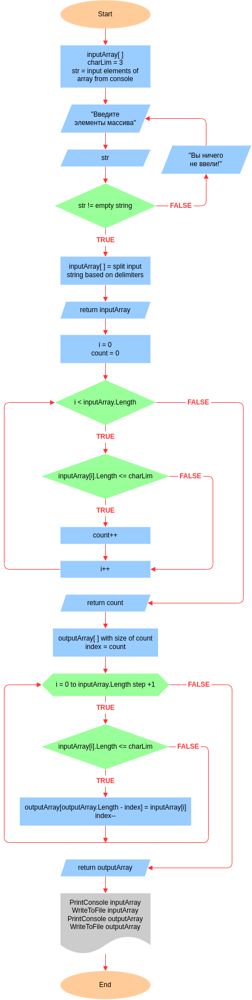

# Итоговая проверочная работа за I четверть

## 🟥 Задача

Написать программу, которая из имеющегося массива строк формирует массив из строк, длина которых меньше либо равна 3 символа. Первоначальный массив можно ввести с клавиатуры, либо задать на старте выполнения алгоритма. При решении не рекомендуется пользоваться коллекциями, лучше обойтись исключительно массивами.

## 🟪 Примеры

```
Input: ["hello", "2", "world", ":-)"]
Output: ["2", ":-)"]
```
```
Input: ["1234", "1567", "-2", "computer science"]
Output: ["-2"]
```
```
Input: ["Russia", "Denmark", "Kazan"]
Output: []
```

## 🟧 Уточнения

- Решение проверочной работы сдается ссылкой на github репозиторий
- В решении можно использовать следующие циклы: `while`, `for`, `foreach`
- Первоначальный массив и результат работы программы выводятся в консоль и сохраняются в текстовые файлы

## 🟩 Структура проекта

```txt
csharp/
└─ test-july-2022-advanced/
   ├─.gitignore
   ├─ Program.cs
   ├─ README.md
   └─ flowchart.drawio.png
```

Проект итоговой проверочной работы структурирован в одном каталоге. Каждое изменение содержания этого каталога будет отражено в таблице, приведенной ниже.

Каталоги и файлы                               | Описание
-----------------------------------------------|--------------------------------------------------------------------------------------------
`/csharp/test-july-2022-advanced`              | Каталог проверочной работы
`/test-july-2022-advanced/.gitignore`          | Файл для исключения из индексации Git файлов и папок проекта
`/test-july-2022-advanced/Program.cs`          | Файл, содержащий решение проверочной работы на языке C#
`/test-july-2022-advanced/README.md`           | Описание задачи, её решения, используемых алгоритмов, а также других файлов проекта
`/test-july-2022-advanced/flowchart.drawio.png`| Блок-схема, описывающая шаги решения задачи

## 🟦 Решение

Согласно условию задачи, первоначальный массив разрешается ввести с клавиатуры.

<details>
<summary><b>Блок-схема</b></summary>



</details>

<details>
<summary><b>Метод ReadInputStream</b></summary>

Считывает из консоли вводимые пользователем данные. Содержащийся в нем метод `Console.ReadLine` cчитывает строку символов из стандартного входного потока, после чего строка записывается в строковую переменную `str`. Если пользователь ввел строку символов и переменная `str` не пустая, тогда строка разбивается на подстроки на основе указанных в `char[] splitChars` символов-разделителей (делиметров). Полученный результат метод возвращает при вызове, например, для инициализации массива. Если же переменная `str` пустая, тогда пользователю сообщается, что данные не были введены и предлагается повторить ввод.

</details>

<details>
<summary><b>Метод CountElem</b></summary>

Считает количество элементов массива строк, размер которых меньше либо равен переменной `charLim`, инициализированной на старте программы. Для этого инициализируется вспомогательная переменная `count = 0`, в которую будет сохраняться количество валидных элементов. Для перебора элементов массива `inputArray` используется цикл `while`. На каждой итерации цикла проверяется длина элемента массива. Если длина элемента меньше либо равна переменной `charLim`, тогда инкрементируется переменная `count`, а затем инкрементируется переменная-счетчик цикла. Если же длина элемента больше переменной `charLim`, тогда инкрементируется только переменная-счетчик цикла. При выходе из цикла, результат подсчета валидных элементов хранится в переменной `count`, которую метод возвращает при вызове.

</details>

<details>
<summary><b>Метод CreateArr</b></summary>

Создает новый массив строк. Размер нового массива `outputArray` определяется переменной `count`, которую возвращает метод `CountElem`, передающийся в качестве аргумента в оператор `new`. Сначала инициализируется локальная переменная `index`, которой присваивается значение, возвращаемое методом `CountElem`. Для перебора элементов массива `inputArray` используется цикл `for`. На каждой итерации цикла проверяется длина элемента массива. Если длина элемента меньше либо равна переменной `charLim`, тогда элемент записывается в новый массив `outputArray`, после чего декрементируется переменная `index`, а затем инкрементируется переменная-счетчик цикла. Если же длина элемента больше трех символов, тогда инкрементируется только переменная-счетчик цикла. Декрементация переменной `index` играет важную роль в правильном заполнении нового массива `outputArray`. Эта переменная используется в вычислении текущей позиции элемента массива `outputArray`, которая рассчитывается вычитанием переменной `index` из длины массива `outputArray`. При выходе из цикла, получается заполненный новый массив строк `outputArray`, удовлетворяющий условию задачи и возвращаемый методом при вызове.

</details>

<details>
<summary><b>Метод Print</b></summary>

Формирует строку из элементов массива. Вначале вспомогательная строковая переменная `output` инициализируется в пустую строку. Для перебора массива, в этом методе используется цикл `foreach`, потому что здесь не требуется других операций с элементами массива, кроме их чтения. На каждой итерации цикла, оператор `+=` поэтапно формирует строку в переменной `output`. При выходе из цикла, результат хранится в переменной `output`, которую метод возвращает при вызове, например, для печати в консоль или сохранения в файл.

</details>

<details>
<summary><b>Метод PrintConsole</b></summary>

Выводит результат работы программы в консоль. Для этого инициализируются локальные переменные, которым присваивается значение, возвращаемое методом `Print`. По этой причине здесь отсутствуют вложенные циклы, однако содержатся условные операторы `if…else`, позволяющие выводить в консоль первоначальный массив строк, либо массив валидных элементов, либо сообщение об отсутствии в первоначальном массиве валидных элементов.

</details>

<details>
<summary><b>Метод WriteToFile</b></summary>

Сохраняет результат работы программы в файлы. Для этого инициализируются локальные переменные, которым присваивается значение, возвращаемое методом `Print`. По этой причине здесь отсутствуют вложенные циклы, однако содержатся условные операторы `if…else`, позволяющие сохранять в разные текствые файлы первоначальный массив строк и массив валидных элементов.

</details>