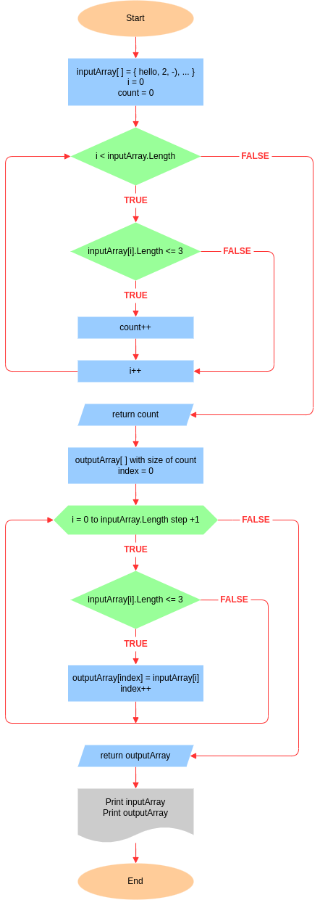

# Итоговая проверочная работа за I четверть

## 🟥 Задача

Написать программу, которая из имеющегося массива строк формирует массив из строк, длина которых меньше либо равна 3 символа. Первоначальный массив можно ввести с клавиатуры, либо задать на старте выполнения алгоритма. При решении не рекомендуется пользоваться коллекциями, лучше обойтись исключительно массивами.

## 🟪 Примеры

```
Input: ["hello", "2", "world", ":-)"]
Output: ["2", ":-)"]
```
```
Input: ["1234", "1567", "-2", "computer science"]
Output: ["-2"]
```
```
Input: ["Russia", "Denmark", "Kazan"]
Output: []
```

## 🟧 Уточнения

- Решение проверочной работы сдается ссылкой на github репозиторий
- В решении можно использовать следующие циклы: `while`, `for`, `foreach`
- Результат работы программы выводится в консоль

## 🟩 Структура проекта

```txt
csharp/
└─ test-july-2022/
   ├─.gitignore
   ├─ Program.cs
   ├─ README.md
   └─ flowchart.drawio.png
```

Проект итоговой проверочной работы структурирован в одном каталоге. Каждое изменение содержания этого каталога будет отражено в таблице, приведенной ниже.

Каталоги и файлы                      | Описание
--------------------------------------|--------------------------------------------------------------------------------------------
`/csharp/test-july-2022`              | Каталог проверочной работы
`/test-july-2022/.gitignore`          | Файл для исключения из индексации Git файлов и папок проекта
`/test-july-2022/Program.cs`          | Файл, содержащий решение проверочной работы на языке C#
`/test-july-2022/README.md`           | Описание задачи, её решения, используемых алгоритмов, а также других файлов проекта
`/test-july-2022/flowchart.drawio.png`| Блок-схема, описывающая шаги решения задачи

## 🟦 Решение

Согласно условию задачи, разрешается задать изначальный массив строк на старте программы.

<details>
<summary><b>Блок-схема</b></summary>



</details>

<details>
<summary><b>Метод CountElem</b></summary>

Считает количество элементов массива строк, размер которых меньше либо равен трем символам. Сперва инициализируется вспомогательная переменная `count = 0`, в которую будет сохраняться количество валидных элементов. Для перебора элементов массива `inputArray` используется цикл `while`. На каждой итерации цикла проверяется длина элемента массива. Если длина элемента меньше либо равна трем символам, тогда инкрементируется переменная `count`, а затем инкрементируется переменная-счетчик цикла. Если же длина элемента больше трех символов, тогда инкрементируется только переменная-счетчик цикла. При выходе из цикла, результат подсчета валидных элементов хранится в переменной `count`, которую метод возвращает при вызове.

</details>

<details>
<summary><b>Метод CreateArr</b></summary>

Создает новый массив строк. Размер нового массива `outputArray` определяется переменной `count`, которую возвращает метод `CountElem`, передающийся в качестве аргумента в оператор `new`. Сначала инициализируется переменная `index = 0`, содержащая позицию элемента нового массива `outputArray`. Для перебора элементов массива `inputArray` используется цикл `for`. На каждой итерации цикла проверяется длина элемента массива. Если длина элемента меньше либо равна трем символам, тогда элемент записывается в новый массив `outputArray`, после чего инкрементируется переменная `index`, а затем инкрементируется переменная-счетчик цикла. Если же длина элемента больше трех символов, тогда инкрементируется только переменная-счетчик цикла. При выходе из цикла, получается заполненный новый массив строк `outputArray`, удовлетворяющий условию задачи и возвращаемый методом при вызове.

</details>

<details>
<summary><b>Метод Print</b></summary>

Выводит результат работы программы в консоль. Для перебора массива, в этом методе используется цикл `foreach`, потому что здесь не требуется других операций с элементами массива, кроме их чтения.

</details>

## 🟫 Git

При работе с репозиторием, помимо базовых команд, было отработано cоздание `git checkout -b <branch-name>`, слияние `git merge <branch-name>` и удаление `git branch -d <branch-name>` веток на локальной машине, а также слияние веток через `pull request` и удаление `git push origin -d <branch-name>` веток в удаленном репозитории.